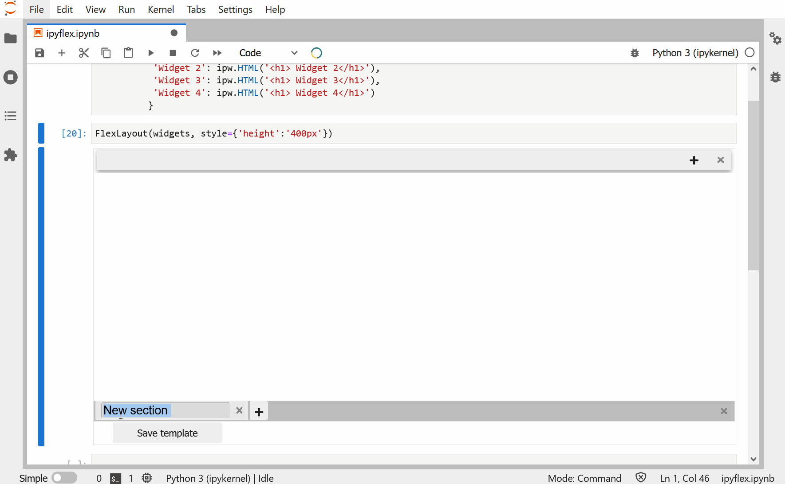

<h1 align="center">ipyflex</h1>
<h2 align="center"> A WYSIWYG layout editor for Jupyter widgets </h1>

Based on the React library [FlexLayout](https://github.com/caplin/FlexLayout), ipyflex allows you to compose the sophisticated dashboard layouts from existing Jupyter widgets without coding. It supports multiple tabs, resizable cards, drag-and-drop layout, save dashboard template to disk, and many more.    
 

## Try it online!

You can try it online by clicking on this badge:

[](https://mybinder.org/v2/gh/trungleduc/ipyflex/master?urlpath=lab%2Ftree%2Fexamples)

## Example
### Dynamic layout


### Stock indexes dashboard


## Documentation

You can read the documentation following this link: https://ipyflex.readthedocs.io

## Installation

You can install using `pip`:

```bash
pip install ipyflex
```

Or using `conda`:

```bash
conda install -c conda-forge  ipyflex
```

And if you use jupyterlab <= 2:

```bash
mamba install -c conda-forge yarn
jupyter labextension install @jupyter-widgets/jupyterlab-manager ipyflex
```


## Development Installation

Create a dev environment:
```bash
conda create -n ipyflex-dev -c conda-forge nodejs yarn python jupyterlab
conda activate ipyflex-dev
```

Install the python. This will also build the TS package.
```bash
pip install -e ".[test, examples]"
```

When developing your extensions, you need to manually enable your extensions with the
notebook / lab frontend. For lab, this is done by the command:

```
jupyter labextension develop --overwrite .
yarn run build
```

For classic notebook, you need to run:

```
jupyter nbextension install --sys-prefix --symlink --overwrite --py ipyflex
jupyter nbextension enable --sys-prefix --py ipyflex
```

Note that the `--symlink` flag doesn't work on Windows, so you will here have to run
the `install` command every time that you rebuild your extension. For certain installations
you might also need another flag instead of `--sys-prefix`, but we won't cover the meaning
of those flags here.

### How to see your changes
#### Typescript:
If you use JupyterLab to develop then you can watch the source directory and run JupyterLab at the same time in different
terminals to watch for changes in the extension's source and automatically rebuild the widget.

```bash
# Watch the source directory in one terminal, automatically rebuilding when needed
yarn run watch
# Run JupyterLab in another terminal
jupyter lab
```

After a change wait for the build to finish and then refresh your browser and the changes should take effect.

#### Python:
If you make a change to the python code then you will need to restart the notebook kernel to have it take effect.
